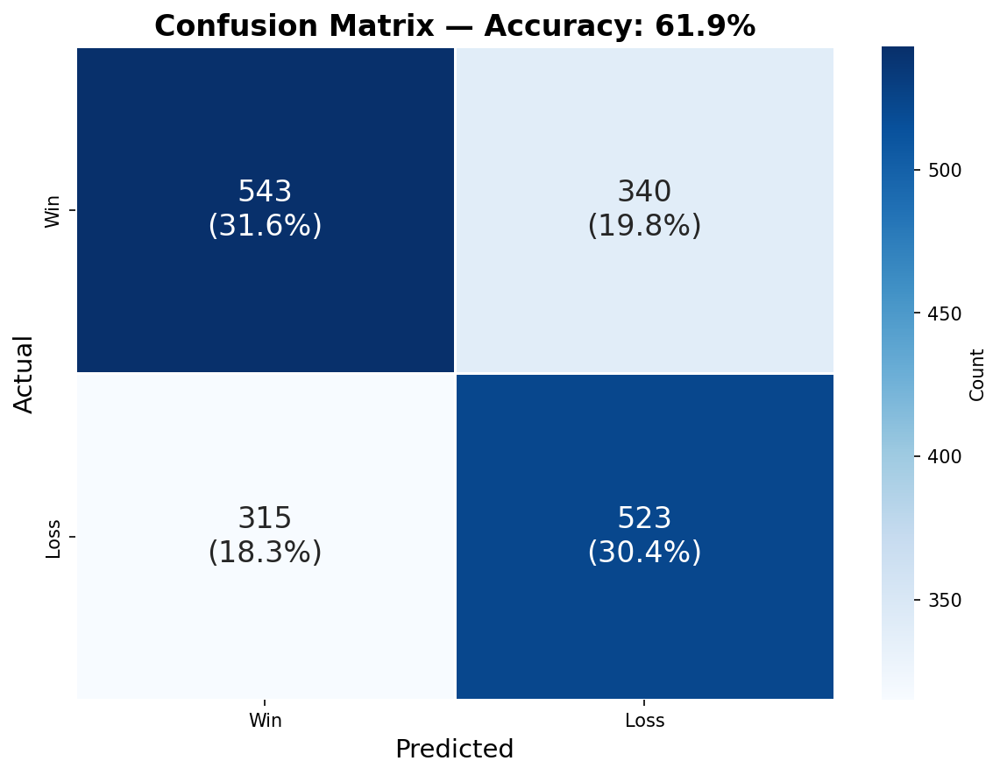
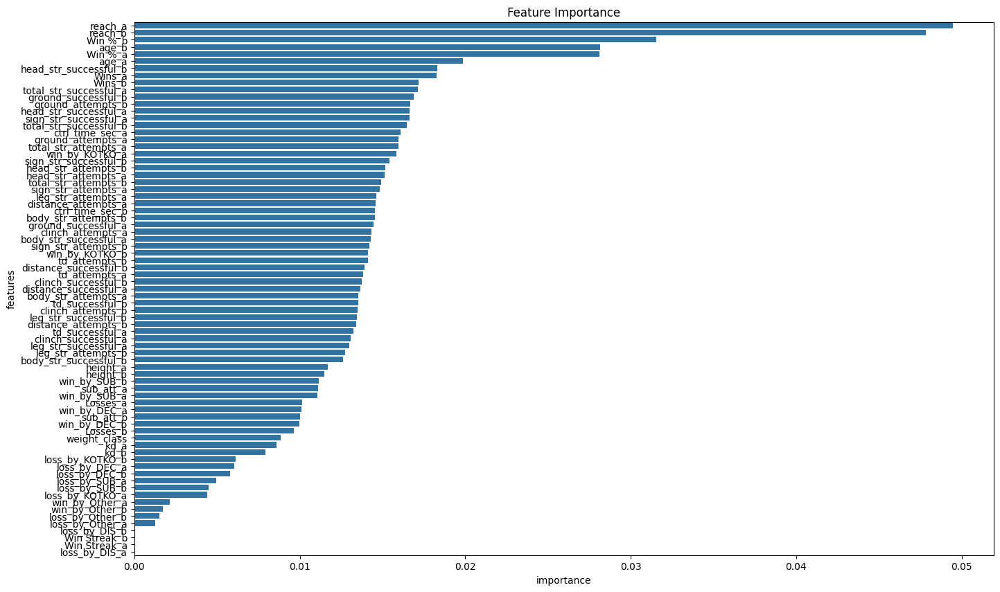

# UFC Fight Outcome Predictor

A machine learning project that predicts UFC fight outcomes using historical fight data, fighter statistics, and advanced feature engineering. The current implementation achieves **62.4% accuracy** using a Random Forest Classifier.

## 🎯 Project Overview

This project builds a comprehensive UFC fight prediction system by:
- Collecting and processing historical UFC fight data from multiple sources
- Engineering features from fighter statistics, performance metrics, and fight history
- Training machine learning models to predict fight outcomes
- Providing an easy-to-use prediction interface for upcoming fights

## 📊 Current Performance
- **Model**: Random Forest Classifier (Scikit-Learn)
- **Test Accuracy**: 62.4%
- **Alternative Model**: XGBoost Random Forest Classifier also available

## 🏗️ Project Structure

```
UFC-Predictor/
├── data/
│   ├── collection/
│   │   ├── raw/                    # Raw data files
│   │   │   ├── event.json
│   │   │   ├── event_card.json
│   │   │   ├── fight_details.json
│   │   │   ├── fight_results.json
│   │   │   ├── fighter_details.json
│   │   │   └── wikipedia_record_table.csv
│   │   └── transformed/            # Processed training data
│   │       └── training_data.csv
│   └── analysis/
│       └── feature_engineering.ipynb
├── training/
│   └── rfclassifier_training.ipynb
├── prediction/
│   └── fight_prediction.ipynb
├── saved_models/
│   ├── skrf_classifier.pkl         # Trained Scikit-Learn RF model
│   └── xgbrf_classifier.pkl        # Trained XGBoost RF model
├── LICENSE                         # GNU AGPL v3
└── README.md
```

## 🔧 Installation & Setup

### Prerequisites
- Python 3.8+
- Jupyter Notebook

### Dependencies
```bash
pip install pandas numpy scikit-learn xgboost scipy thefuzz pickle
```

### Core Libraries Used
- **Data Processing**: `pandas`, `numpy`
- **Machine Learning**: `scikit-learn`, `xgboost`
- **Model Persistence**: `pickle`
- **String Matching**: `thefuzz` (for fighter name alignment)
- **Statistical Operations**: `scipy`

## 📈 Data Pipeline

### 1. Data Collection
The project integrates multiple data sources:
- **UFC Statistics**: Fight details, results, and fighter profiles
- **Event Information**: Card details and event metadata  
- **Wikipedia Records**: Historical fight records for validation
- **Fighter Details**: Physical attributes, career statistics

### 2. Feature Engineering
The feature engineering process (`data/analysis/feature_engineering.ipynb`) includes:

- **Fighter Statistics Integration**: Merging fight records with fighter profiles
- **Historical Performance Metrics**: Win streaks, win percentages, fight history
- **Rolling Averages**: Capturing performance trends over time
- **Physical Attributes**: Height, reach, age, weight class
- **String Matching**: Token set ratio for accurate fighter-event alignment
- **Data Leakage Prevention**: Ensuring only prior information is used

### 3. Training Data Structure
The final training dataset contains **80 features** including:

#### Fight Statistics (per fighter):
- Significant strikes (successful/attempted)
- Total strikes (successful/attempted) 
- Takedowns (successful/attempted)
- Submission attempts
- Control time
- Distance metrics

#### Historical Performance:
- Total wins/losses
- Win streak
- Win methods (Decision, KO/TKO, Submission, Other)
- Loss methods breakdown
- Career statistics

#### Physical & Contextual:
- Weight class (encoded)
- Physical measurements
- Experience metrics

## 🤖 Machine Learning Models

### Random Forest Classifier (Primary)
- **Library**: Scikit-Learn
- **Features**: 75+ engineered features
- **Training**: 80/20 train-test split
- **Hyperparameter Tuning**: RandomizedSearchCV
- **Performance**: 62.4% test accuracy

### XGBoost Random Forest (Alternative)
- **Library**: XGBoost
- **Configuration**: Random Forest mode
- **Same feature set and preprocessing**

## 🎮 Usage

### Training a Model
```python
# Run the training notebook
jupyter notebook training/rfclassifier_training.ipynb
```

### Making Predictions
```python
# Example prediction setup
from prediction.fight_prediction import create_match, predict_outcome

# Create matchup features
features = create_match(
    selection_df,
    fighter_a=["Jon Jones", "Islam Makhachev"],
    fighter_b=["Tom Aspinall", "Ilia Topuria"], 
    weight_class=["Heavyweight", "Lightweight"]
)

# Get predictions
predictions = predict_outcome(training_data, features)
print(predictions)
```

### Sample Output
```
                 Fighter              Opponent Result  Vote Share
0              Jon Jones          Tom Aspinall    win    0.578142
1        Islam Makhachev          Ilia Topuria    win    0.657387
```

## 🔍 Key Features

### Data Quality Assurance
- Duplicate removal and data validation
- Missing value handling with domain-specific logic
- Exclusion of draws and no-contests for binary classification
- Cross-validation of data sources

### Feature Engineering Highlights
- **Temporal Consistency**: Rolling averages prevent data leakage
- **String Matching**: Fuzzy matching for fighter name standardization  
- **Comprehensive Stats**: 75+ features covering all aspects of fighter performance
- **Weight Class Integration**: Proper encoding of weight divisions

### Model Features
- **Hyperparameter Optimization**: Automated parameter tuning
- **Cross-Validation**: Robust model evaluation
- **Multiple Algorithms**: Both Scikit-Learn and XGBoost implementations
- **Probability Estimates**: Confidence scores for predictions

## 📊 Model Performance & Insights

- **Baseline Accuracy**: 62.4% on test data
- **Feature Importance**: Fight statistics and historical performance are key predictors
- **Prediction Confidence**: Vote share provides prediction confidence levels
- **Model Comparison**: Both Random Forest implementations show similar performance

### Confusion Matrix


### Feature Importance


## 🛠️ Development Workflow

1. **Data Collection**: Gather raw fight data from multiple sources
2. **Data Integration**: Align and merge datasets using string matching
3. **Feature Engineering**: Create comprehensive fighter profiles and statistics  
4. **Model Training**: Train and tune machine learning models
5. **Evaluation**: Validate model performance on test data
6. **Prediction**: Generate predictions for new fight matchups

## 📝 Data Sources & Attribution

- UFC fight statistics and results
- Fighter profile information
- Wikipedia fight records for validation
- Event and card details

## 🔮 Future Improvements

- **Enhanced Features**: Betting odds, recent form, stylistic matchups
- **Advanced Models**: Neural networks, ensemble methods
- **Real-time Data**: Integration with live data sources
- **Feature Selection**: Automated feature importance analysis
- **Model Interpretability**: SHAP values and feature explanations
